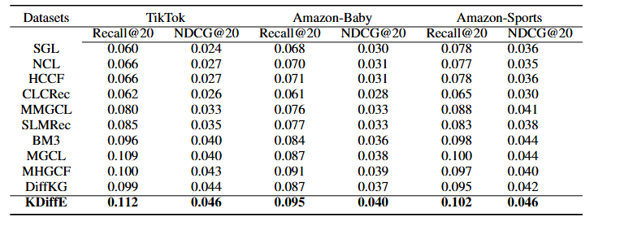

## KDiffE
Knowledge-aware Diffusion-Enhanced for Multimedia Recommendation
## 📝 Environment

We develop our codes in the following environment:

- python==3.9.13
- numpy==1.23.1
- torch==1.11.0
- scipy==1.9.1

## 📚 Datasets

| Datasets          | User        | Item      | Interactions | Modality      |
| ------------------- | --------------- |-----------| ---------------- |---------------|
| TikTok             | 9,319          | 6,710   |59,541          | V     A     T |
| Amazon-Baby            | 19,445         | 7,050    | 139,110           | V    T        |
| Amazon-Sports       | 35,598       | 2,18,357 | 256,308        | V  T          |

## 🚀 How to run the codes

The command lines to train KDiffE on the three datasets are as below. The un-specified hyperparameters in the commands are set as default.

- TikTok 

```python
 python Main.py --data tiktok --epoch 130 --trans 1  --cl_method 1 --temp 0.7 --similarity '130_6' --epsilon 0.9 --gpu '4' --step 10 --e_loss 0.7

```

- Amazon-Baby 

```python
python Main.py --data baby  --epoch 130 --gpu '1' --temp 1 --similarity '50_8' --epsilon 0.6 --ssl_reg 0.1 --step 10 --e_loss 0.9 --keepRate 1 --q 1

```

- Amazon-Sports

```python
 python Main.py --data sports --reg 1e-6  --temp 0.2 --res_lambda 0.1 --keepRate 1 --trans 1 --epoch 130 --gpu '0' --similarity '130_20' --epsilon 1 --e_loss 0.5 --q 2 --step 10
```

## 👉 Code Structure

```
.
├── README.md
├── Main.py
├── Model.py
├── Params.py
├── DataHandler.py
├── Utils
│   ├── TimeLogger.py
│   └── Utils.py
└── Datasets
    ├──TikTok 
    │   ├── trnMat.pkl
    │   ├── tstMat.pkl
    |   ├── image_feat.npy.zip
    |   ├── text_feat.npy
    |   ├── audio_feat.npy
    |   ├── Similarity_130_6.pkl
    │   └── kg.txt
    ├── Baby 
    │   ├── trnMat.pkl
    │   ├── tstMat.pkl
    |   ├── image_feat.npy.zip
    |   ├── text_feat.npy
    |   ├── Similarity_50_8.pkl
    │   └── kg.txt
    └── Sports
        ├── trnMat.pkl
        ├── tstMat.pkl
        ├── image_feat.zip
        ├── text_feat.npy
        ├── Similarity_130_20.pkl
        └── kg.txt
```

## 🎯 Experimental Results

Performance comparison of baselines on different datasets in terms of Recall@20 and NDCG@20:



## Acknowledgement
We are particularly grateful to the authors of [DiffKG][1], as parts of our code implementation were derived from their work. We have cited the relevant references in our paper.  

[1]: https://arxiv.org/pdf/2312.16890


